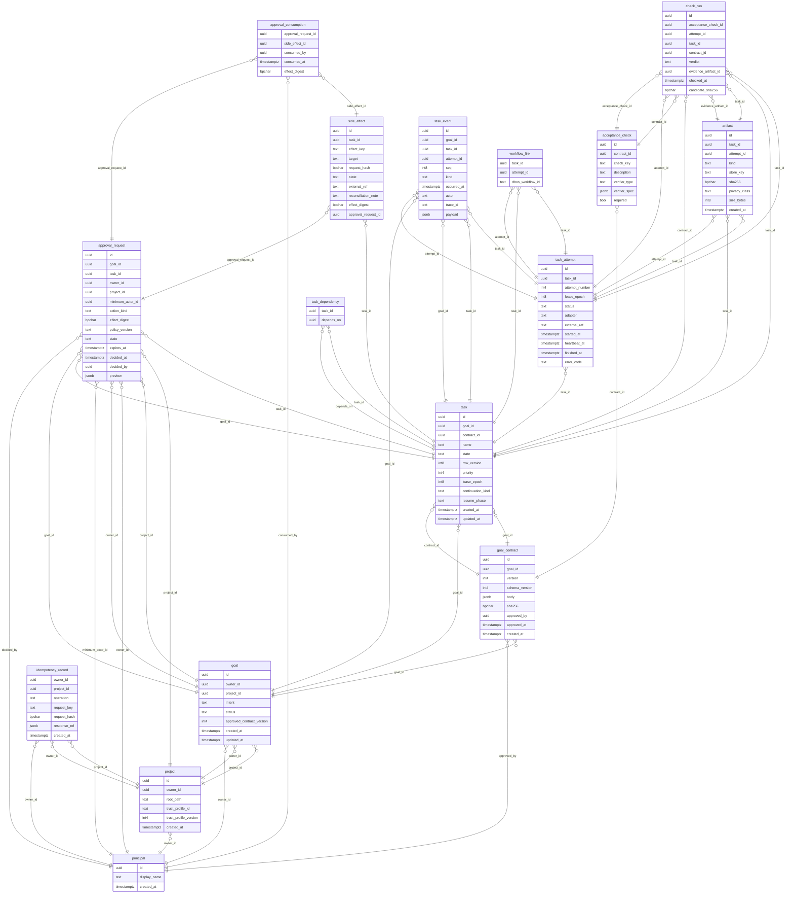

# Synthetic schema diagram

Generated from the migrated `panestria` schema at Alembic head `0004_check_candidate`.
This diagram is not a fresh-host result, and R0 is not accepted.

```mermaid
erDiagram
    acceptance_check {
        uuid id
        uuid contract_id
        text check_key
        text description
        text verifier_type
        jsonb verifier_spec
        bool required
    }
    approval_consumption {
        uuid approval_request_id
        uuid side_effect_id
        uuid consumed_by
        timestamptz consumed_at
        bpchar effect_digest
    }
    approval_request {
        uuid id
        uuid goal_id
        uuid task_id
        uuid owner_id
        uuid project_id
        uuid minimum_actor_id
        text action_kind
        bpchar effect_digest
        text policy_version
        text state
        timestamptz expires_at
        timestamptz decided_at
        uuid decided_by
        jsonb preview
    }
    artifact {
        uuid id
        uuid task_id
        uuid attempt_id
        text kind
        text store_key
        bpchar sha256
        text privacy_class
        int8 size_bytes
        timestamptz created_at
    }
    check_run {
        uuid id
        uuid acceptance_check_id
        uuid attempt_id
        uuid task_id
        uuid contract_id
        text verdict
        uuid evidence_artifact_id
        timestamptz checked_at
        bpchar candidate_sha256
    }
    goal {
        uuid id
        uuid owner_id
        uuid project_id
        text intent
        text status
        int4 approved_contract_version
        timestamptz created_at
        timestamptz updated_at
    }
    goal_contract {
        uuid id
        uuid goal_id
        int4 version
        int4 schema_version
        jsonb body
        bpchar sha256
        uuid approved_by
        timestamptz approved_at
        timestamptz created_at
    }
    idempotency_record {
        uuid owner_id
        uuid project_id
        text operation
        text request_key
        bpchar request_hash
        jsonb response_ref
        timestamptz created_at
    }
    principal {
        uuid id
        text display_name
        timestamptz created_at
    }
    project {
        uuid id
        uuid owner_id
        text root_path
        text trust_profile_id
        int4 trust_profile_version
        timestamptz created_at
    }
    side_effect {
        uuid id
        uuid task_id
        text effect_key
        text target
        bpchar request_hash
        text state
        text external_ref
        text reconciliation_note
        bpchar effect_digest
        uuid approval_request_id
    }
    task {
        uuid id
        uuid goal_id
        uuid contract_id
        text name
        text state
        int8 row_version
        int4 priority
        int8 lease_epoch
        text continuation_kind
        text resume_phase
        timestamptz created_at
        timestamptz updated_at
    }
    task_attempt {
        uuid id
        uuid task_id
        int4 attempt_number
        int8 lease_epoch
        text status
        text adapter
        text external_ref
        timestamptz started_at
        timestamptz heartbeat_at
        timestamptz finished_at
        text error_code
    }
    task_dependency {
        uuid task_id
        uuid depends_on
    }
    task_event {
        uuid id
        uuid goal_id
        uuid task_id
        uuid attempt_id
        int8 seq
        text kind
        timestamptz occurred_at
        text actor
        text trace_id
        jsonb payload
    }
    workflow_link {
        uuid task_id
        uuid attempt_id
        text dbos_workflow_id
    }
    acceptance_check }o--|| goal_contract : contract_id
    approval_consumption }o--|| approval_request : approval_request_id
    approval_consumption }o--|| principal : consumed_by
    approval_consumption }o--|| side_effect : side_effect_id
    approval_request }o--|| principal : decided_by
    approval_request }o--|| goal : goal_id
    approval_request }o--|| task : goal_id
    approval_request }o--|| principal : minimum_actor_id
    approval_request }o--|| goal : owner_id
    approval_request }o--|| principal : owner_id
    approval_request }o--|| goal : project_id
    approval_request }o--|| project : project_id
    approval_request }o--|| task : task_id
    artifact }o--|| task_attempt : attempt_id
    artifact }o--|| task : task_id
    artifact }o--|| task_attempt : task_id
    check_run }o--|| acceptance_check : acceptance_check_id
    check_run }o--|| task_attempt : attempt_id
    check_run }o--|| acceptance_check : contract_id
    check_run }o--|| task : contract_id
    check_run }o--|| artifact : evidence_artifact_id
    check_run }o--|| artifact : task_id
    check_run }o--|| task : task_id
    check_run }o--|| task_attempt : task_id
    goal }o--|| principal : owner_id
    goal }o--|| project : owner_id
    goal }o--|| project : project_id
    goal_contract }o--|| principal : approved_by
    goal_contract }o--|| goal : goal_id
    idempotency_record }o--|| principal : owner_id
    idempotency_record }o--|| project : owner_id
    idempotency_record }o--|| project : project_id
    project }o--|| principal : owner_id
    side_effect }o--|| approval_request : approval_request_id
    side_effect }o--|| task : task_id
    task }o--|| goal_contract : contract_id
    task }o--|| goal : goal_id
    task }o--|| goal_contract : goal_id
    task_attempt }o--|| task : task_id
    task_dependency }o--|| task : depends_on
    task_dependency }o--|| task : task_id
    task_event }o--|| task_attempt : attempt_id
    task_event }o--|| goal : goal_id
    task_event }o--|| task : goal_id
    task_event }o--|| task : task_id
    task_event }o--|| task_attempt : task_id
    workflow_link }o--|| task_attempt : attempt_id
    workflow_link }o--|| task : task_id
    workflow_link }o--|| task_attempt : task_id
```
